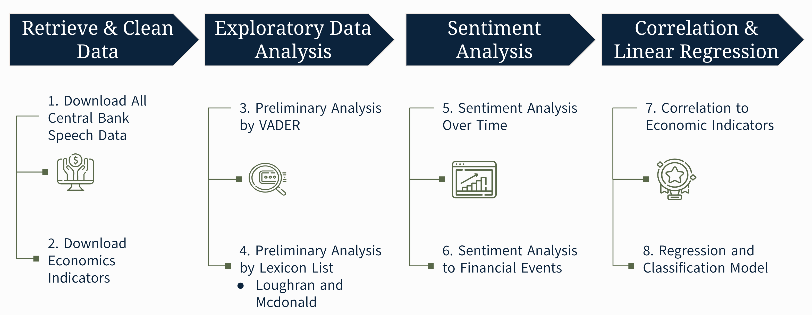
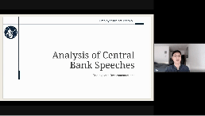

<h1>Sentiment Analysis of Bank of England Speeches</h1>
  <h3> Topics Covered</h3>
  
   * Data Sourcing and Importation, Data Wrangling
   * Natural Language Processing
   * Sentiment Analysis (VADER & using a custom lexicon list)
   * Topic Analysis (Latent Dirichlet Allocation (LDA), Dynamic Topic Modelling (DTM))
   *  Correlation Analysis (Time-lag/ Cross-correlation, Granger Causality, Seasonal Decomposition)
   *  Regression Analysis, Logistic Classification

Grade: __TBD__

<h2>Project Introduction</h2> 
  

The Bank of England (BOE) plays a critical role in maintaining economic stability and market confidence. Central to this function is the Bank's strategic use of speeches its representatives deliver at public forums. Indeed, central bank communication influences financial markets and increases the predictability of monetary policy. 
This report examines the relationship between BOE speeches and the broader economic landscape. By analysing speech content and aligning it with economic events, including global crises, potential opportunities, and key economic indicators, our objective is to address the following business questions:
    
1. How has sentiment changed over time? 
2. How does sentiment correlate with events? 
3. How does sentiment correlate with economic indicators?
4. Does sentiment have the power to predict market behaviour?

Principally, we analyse the sentiments expressed in these speeches. Understanding how sentiments correlate with subsequent market behaviours can help us discover whether the BOE's communication is reactive or if it exhibits proactive, predictive, or even prescriptive qualities. This could reveal how the BOE influences the economic narrative, potentially shaping policy outcomes and market reactions. 

Previous research indicates that central bank communications are a vital source of information, providing insights into their perspectives on current and future economic conditions. Our sentiment analysis of BOE speeches offers valuable contributions to understanding the BOE's role in affecting economic outcomes.

<h2>Methodology</h2> 

The figure above maps our methodology for analysing the BOE speeches and their correlation with economic indicators, which we can categorise more broadly into 3 parts: __data sourcing, cleaning, and analysis__. 

<h3>Data Sourcing</h3>
<table>
  <tr>
    <th>Analysis Type</th>
    <th>Methodology</th>
  </tr>
  <tr>
    <td><strong>Speeches</strong></td>
    <td>
      <ul>
        <li>Acquired speeches directly from the BOE, spanning the same period, formatted in Excel.</li>
      </ul>
    </td>
  </tr>
  <tr>
    <td><strong>Economic Metrics</strong></td>
    <td>
      <ul>
        <li>Sourced economic indicators from reputable platforms, including the ONS, World Bank, investing.com, etc.</li>
        <li>GDP data in US dollars for standardisation and ease of international comparison.</li>
        <li>Data collection spanned from 1997 to 2022, aligning with the availability and relevance of BOE speeches.</li>
      </ul>
    </td>
  </tr>
</table>

<h3>Data Cleaning</h3>
<table>
  <tr>
    <th>Analysis Type</th>
    <th>Methodology</th>
  </tr>
  <tr>
    <td><strong>Speeches</strong></td>
    <td>
      <ul>
        <li>Python was employed to filter the dataset, focusing on speeches relevant to the UK.</li>
        <li>We checked for duplicates, missing data, and consistency in data and date formats.</li>
      </ul>
    </td>
  </tr>
  <tr>
    <td><strong>Economic Metrics</strong></td>
    <td>
      <ul>
        <li>Utilised Excel for initial processing, addressing missing values and inaccuracies through functions and filtering techniques.</li>
        <li>Python used to standardise date formats to YYYY-MM and facilitate data export to GitHub, ensuring collaborative efficiency.</li>
      </ul>
    </td>
  </tr>
</table>

<h3>Data Analysis</h3>
<table>
  <tr>
    <th>Analysis Type</th>
    <th>Methodology</th>
  </tr>
  <tr>
    <td><strong>Sentiment Analysis</strong></td>
    <td>
      <ul>
        <li>Applied Valence Aware Dictionary and Sentiment Reasoner (VADER) for initial sentiment assessment, establishing a baseline sentiment.</li>
        <li>Advanced the analysis with the Loughran and McDonald Words List (LMW), which is a sentiment lexicon for financial text mining.</li>
      </ul>
    </td>
  </tr>
  <tr>
    <td><strong>Topic Analysis</strong></td>
    <td>
      <ul>
        <li>Utilised Latent Dirichlet Allocation (LDA) for its efficiency in revealing latent themes within the speeches.</li>
      </ul>
    </td>
  </tr>
  <tr>
    <td><strong>Statistical Testing</strong></td>
    <td>
      <ul>
        <li>Conducted correlation analysis (Pearson’s and Spearman's coefficients) to identify relationships between sentiment and economic indicators.</li>
        <li>Performed time-lag and cross-correlation analysis, along with Granger causality tests, to explore causal relationships.</li>
        <li>Utilised linear and time series regression models to understand and quantify these relationships.</li>
      </ul>
    </td>
  </tr>
</table>

<h2>Findings and Recommendations - Final Stakeholder Presentation</h2> 

If you would like to view the video recording of the presentation delivered to the Bank of England, please click below (navigates to a Google Drive video). The Presentation is 20 minutes long with 10 minutes of feedback from the BOE at the end. 
* The timestamps where I am presenting are between 00:02 - 02:36 and 10:50 - 20:08: 

